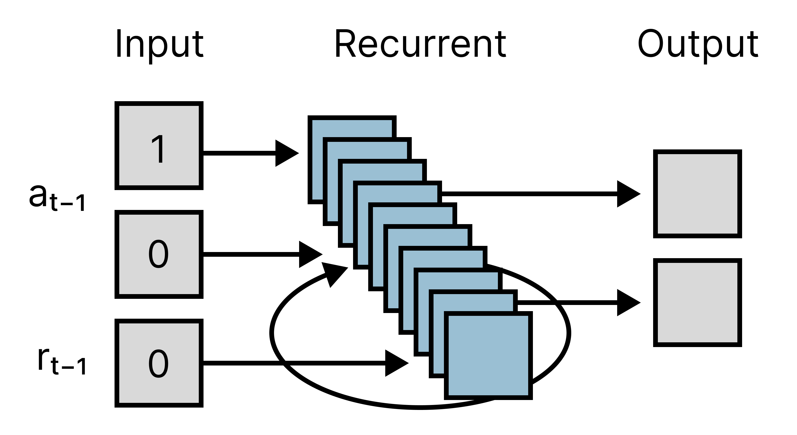
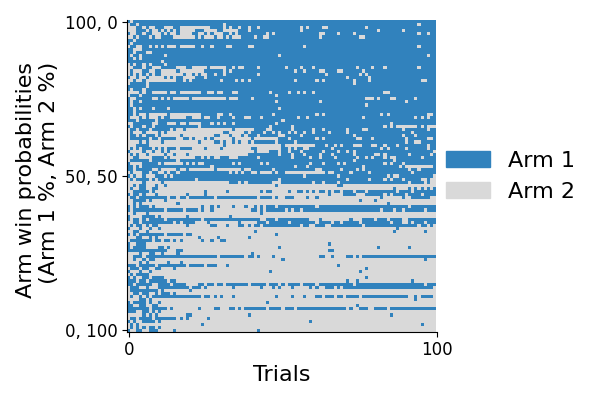

# Meta-reinforcement learning (meta-rl)

This is a short conceptual replication of one of my favorite papers, using the [Jax Ecosystem](https://github.com/google/jax#neural-network-libraries):

[Prefrontal cortex as a meta-reinforcement learning system by Wang, Kurth-Nelson et al. in *Nature Neuroscience* (2018)](https://www.nature.com/articles/s41593-018-0147-8).

The model replicated here learns to change its actions based on the reward it experiences—even after its parameters are frozen. In effect, the model learns to implement its own reinforcement learning (RL) algorithm. How cool is that!

## Overview

This replication focuses on a [multi-armed bandit experiment](https://en.wikipedia.org/wiki/Multi-armed_bandit), where there are *N* possible actions, and each action has some probability of winning (i.e., a reward of 1 instead of a reward of 0). The goal of this task is to get the most rewards possible. Ideally, an agent in this experiment with no prior knowledge would sample available actions to get an idea of the win probabilities of each action (exploration), before settling on mostly selecting the action with the higher win probability (exploitation). Multi-armed bandits are often illustrated with a slot machine analogy, where you have a row of *N* simple slot machines, each with their own win probability, and you must choose which slot machine to play next.

Some definitions:

  * Trial: A single choice between all available actions.

  * Episode: A chain of multiple trials. In this experiment, the win probability for each available action is randomly chosen at the start of each episode (0% to 100%), and does not change throughout the episode. Model memory is also reset between episodes.

The reinforcement learning model we train to complete this task is a simple recurrent neural network with 3 fully-connected layers:

  * Input: A [one-hot encoding](https://en.wikipedia.org/wiki/One-hot) of the model's previous action, and the reward the model was given on the previous trial. Inputs are all zeros at the start of an episode.

  * Recurrent: *M* [LSTM units](https://en.wikipedia.org/wiki/Long_short-term_memory). LSTM memory is initialized with zeros at the start of an episode.

  * Output: One linear unit for each of the *N* available actions. The model's action is selected from these output unit activations probabilistically after a softmax operation.

<p align="center" width="100%">
    
</p>

After a certain number of steps (or at the end of each episode), model parameters are updated via the [Asynchronous Advantage Actor Critic (A3C) reinforcement learning algorithm](https://arxiv.org/abs/1602.01783). After training, model parameters are frozen and the model is evaluated on the same task.

## Results

Here are some results from model evaluation after training (i.e., model parameters have been frozen) in a task with 2 available actions (also known as a two-armed bandit task).

Each row is a single, independent evaluation episode of 100 trials. The rows are ordered based on the probabilities of the two actions, with 100% win probability for action 1 and 0% win probability for action 2 in the top row, 50% win probability for action 1 and 50% win probability for action 2 in the middle, and 0% win probability for action 1 and 100% win probability for action 2 in the bottom row.

The color of each trial corresponds to the model's action on that trial (blue, Arm 1; grey, Arm 2).

Notice that at the beginning of each episode (trials on the left) model actions are mostly random. As the model gets more experience with each action, it learns to select the action with the greater win probability. This learning happens quicker for episodes where there is a greater difference between the win probabilities of the two actions.

<p align="center" width="100%">
    
</p>

From [the paper](https://arxiv.org/pdf/1611.05763.pdf):
> "[...] here the procedure the recurrent network implements is itself a full-fledged reinforcement learning algorithm, which negotiates the exploration-exploitation tradeoff and improves the agent’s policy based on reward outcomes. A key point [...] is that this learned RL procedure can differ starkly from the algorithm used to train the network’s weights. 

Note: Your results will likely be different given the randomness involved in training and evaluation, even with the same hyperparameters.

## Getting started

### Training
To train a model in the browser using a Google Colab notebook, run `train.ipynb`: [](https://colab.research.google.com/github/nathanwispinski/meta-rl/blob/main/train.ipynb)

Model training in the Colab is single-threaded, and may take a while. After training is done, the Colab will save a `*.pickle` file with the trained model parameters that you can download. If you would like to skip training and go straight to the results, `trained_agent.pickle` is provided for you.

### Evaluation and analysis
To evaluate and analyze the results of a trained model in the browser using a Google Colab notebook, run `eval_and_analyze.ipynb`: [](https://colab.research.google.com/github/nathanwispinski/meta-rl/blob/main/eval_and_analyze.ipynb)

You can load the provided `trained_agent.pickle` file, or provide your own from training.

### Playing the task yourself
To play the environment as a human, run `play_env_as_human.ipynb` in Google Colab: [](https://colab.research.google.com/github/nathanwispinski/meta-rl/blob/main/play_env_as_human.ipynb)


## Diving deeper

For some more involved interrogation of this code, you will need a copy of this repository. Note: this code has been tested with [Python 3.9.16](https://www.python.org/downloads/release/python-3916/)—this code may not work with other versions of Python. As this code relies on [Jax](https://github.com/google/jax), it does not currently work on Windows machines out-of the-box as of the time I write this (but see [Windows Subsystem for Linux](https://learn.microsoft.com/en-us/windows/wsl/install)).

First, clone this repository into a folder on your computer using [git](https://github.com/git-guides/install-git):

```sh
git clone https://github.com/nathanwispinski/meta-rl
```

When in the `meta-rl` folder, install the dependencies in `requirements.txt` using [pip](https://pip.pypa.io/en/stable/installation/):

```sh
pip install -r requirements.txt
```

For distributed (i.e., multi-threaded) training and evaluation, double check your hardware against `config.num_workers` and `config.num_evaluators`. Each of these will start new multiprocessing processes in python, which will each need an additional CPU core. If you have fewer cores than processes, the code will run much slower.

For distributed training run:

```sh
python main.py --config=configs.bandit_config_train.py
```

- The manager will output a `log.INFO` file.
- The evaluator will output a `*.csv` file.
- The manager will save a `*.pickle` file with the final saved model parameters.

To customize training, create a new config file to provide to the launch training command, e.g., 

```sh
python main.py --config=configs.new_config.py
```

Or provide config override arguments at the command line level, e.g.,

```sh
python main.py --config=configs.bandit_config_train.py --config.agent.random_seed=42
```

For distributed evaluation run:

```sh
python main.py --config=configs.bandit_config_eval.py
```

- The manager will save a `data_*.pickle` file with evaluation data when done.

To customize evalution, similarly create a new evaluation config, or provide override arguments at the command line.

## References

[1] [Wang, J. X., Kurth-Nelson, Z., Kumaran, D., Tirumala, D., Soyer, H., Leibo, J. Z., ... & Botvinick, M. (2018). Prefrontal cortex as a meta-reinforcement learning system. *Nature neuroscience*, *21*(6), 860-868.](https://www.nature.com/articles/s41593-018-0147-8)

[2] [Wang, J. X., Kurth-Nelson, Z., Tirumala, D., Soyer, H., Leibo, J. Z., Munos, R., ... & Botvinick, M. (2016). Learning to reinforcement learn. *arXiv*:1611.05763.](https://arxiv.org/pdf/1611.05763.pdf)
